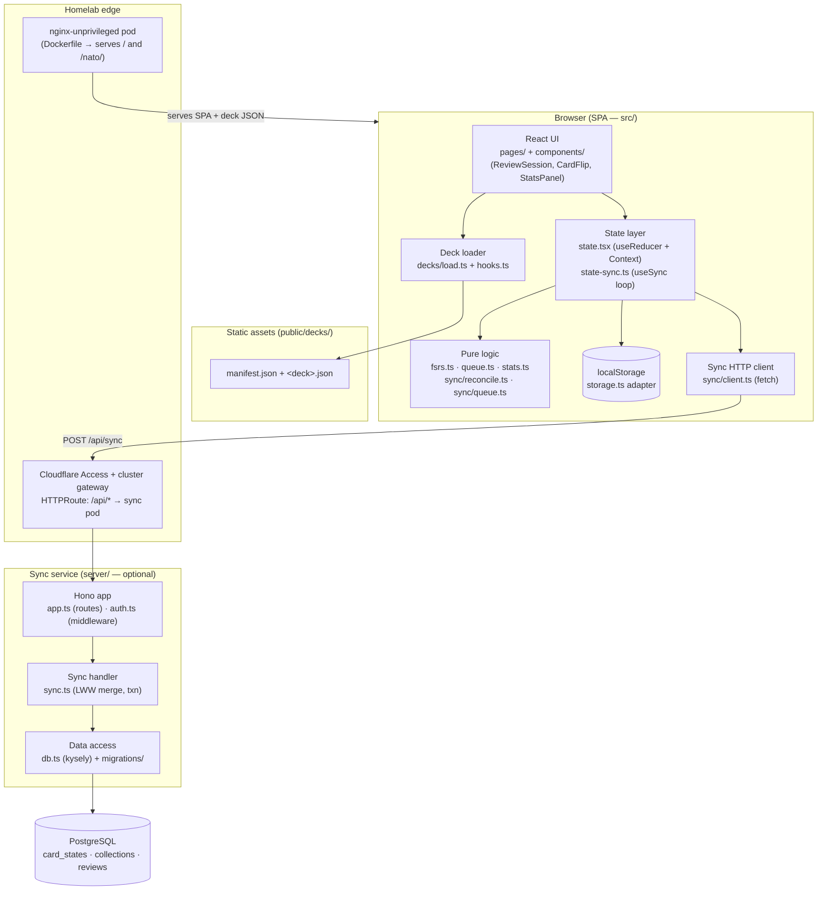

# Architecture

This document describes how **flashcards** is put together: a multi-deck,
spaced-repetition flashcard app that is **local-first** (fully usable with no
backend) plus an **optional** sync service that carries per-user state across
devices.

For usage, deck format, routes, and keyboard shortcuts see [README.md](./README.md).
For the sync HTTP contract see [server/README.md](./server/README.md).

> Scope: this describes what is on `main`. A distributed-locks / advisory-lock
> experiment lives on a feature branch and is intentionally **not** documented
> here.

## Purpose & context

The app drills a user on bundled decks (financial terminology, NATO phonetic
alphabet, system-design latency numbers, tech acronyms) and on user-defined
**collections** that merge several decks into one due queue.

Scheduling is **FSRS-4.5** (Free Spaced Repetition Scheduler), not SM-2, via the
[`ts-fsrs`](https://github.com/open-spaced-repetition/ts-fsrs) library. Each card
carries FSRS state — difficulty (D), stability (S), and a derived retrievability
(R) — and every rating (`Again` / `Hard` / `Good` / `Easy`) advances that state
and computes the next due date targeting ≈0.9 recall probability. The FSRS math
itself is owned by `ts-fsrs`; this repo wraps it in `src/fsrs.ts`.

The defining constraint is **local-first**: card state, collections, and review
history live in the browser's `localStorage` and hydrate **synchronously** at
boot, so there is no async "empty-then-hydrated" window in which a fresh rating
could be clobbered by a late hydrate. The sync service is a strictly optional
overlay — if it is unreachable, the app keeps working and queues mutations for
later.

## Component / dependency diagram



Two independently deployed images:

- **`ghcr.io/gjcourt/flashcards`** — the static SPA served by nginx (built from
  `Dockerfile`). No server-side rendering; nginx only serves files and a
  `/healthz` probe.
- **`ghcr.io/gjcourt/flashcards-sync`** — the optional Node/Hono sync service
  (built from `Dockerfile.sync`), backed by Postgres.

The browser talks to Postgres only indirectly, through `POST /api/sync`. The
SPA and the sync service share no code — the wire types in `src/sync/types.ts`
and `server/src/schema.ts` are **deliberately duplicated** (see Design decisions).

## Request / data flows

### 1. Load a deck and build the due queue

1. A route such as `/decks/:id` renders (`src/router.tsx` → `pages/DeckReview.tsx`).
2. `decks/hooks.ts` (`useDeck` / `useDecks`) fetches `public/decks/manifest.json`
   (memoised at module scope) then the deck JSON, via `decks/load.ts`
   (`fetchManifest` → `fetchDeck`). Every field is validated by type predicates;
   `materialise()` prefixes card ids with the deck id (`nato:a`) and stamps fresh
   FSRS state with `fsrs.ts#newCard`.
3. `ReviewSession` reads persisted FSRS state via `useCardStates()` and calls
   `useDueQueue` (`src/queue.ts`). `buildDueQueue` overlays stored state onto the
   loaded cards, filters to due (non-`New`, `due <= now`) cards sorted by
   ascending retrievability (most-likely-forgotten first), then appends `New`
   cards in input order.

### 2. Review a card → scheduling update → persistence → enqueue

1. In `ReviewSession`, the user flips (`Space`) and rates (`1`–`4`, mapped to
   `ts-fsrs` `Rating`).
2. `useRateCard` (`src/state.tsx`) calls `fsrs.ts#rate`, which runs
   `scheduler.next(card, now, grade)` to produce the new FSRS state and a
   `ReviewLog`.
3. It dispatches `RATE_CARD` to the reducer, updating `cardStates[cardId]` and
   appending a `ReviewLogEntry` (capped at `REVIEW_LOG_CAP = 1000`).
4. `useEffect`s in `StateProvider` persist the changed slice to `localStorage`
   via `storage.ts` (`saveCardStates` / `saveReviews`). The **first** write per
   slice is skipped because those values were just read during synchronous
   `init()`.
5. In the same call, `useRateCard` **enqueues** two mutations onto the sync queue
   — a `cardState` envelope and a `review` envelope — through `state-sync.ts`.
   `sync/queue.ts#enqueue` coalesces `cardState`/`collection` by id (only the
   latest local state matters) but keeps `review` entries append-only (each is a
   distinct historical event). The queue is persisted to `localStorage`
   (`flashcards:sync-queue`).

### 3. Background sync (push + pull, LWW merge)

The `useSync` hook (`src/state-sync.ts`) drives a loop that runs on mount, every
60 s, and on `visibilitychange → visible`:

1. Snapshot the queue and read `since = lastSyncAt`.
2. `sync/client.ts#syncOnce` POSTs `{ since, mutations }` to `/api/sync`. It
   classifies failures into `OfflineError` (network/unreachable — retry silently,
   downgrade UI to `offline`) vs `ServerError` (non-2xx — surface to the user),
   and validates the response shape at the boundary.
3. On success, the server's rows are applied to local state **before** the queue
   is cleared (so a crash between the two leaves the queue intact to re-push).
   The `RECONCILE` action runs the pure reconcilers in `sync/reconcile.ts`:
   - **card states** — last-write-wins on `fsrs.last_review`;
   - **collections** — LWW on `updatedAt`, with tombstones (`deletedAt`) removing
     the local copy;
   - **reviews** — de-duped on `(cardId, ratedAt)`, merged in `ratedAt` order,
     capped at `REVIEW_LOG_CAP`.
4. `sync/queue.ts#removeSnapshot` removes exactly the flushed entries (entries
   enqueued during the request survive), `lastSyncAt` is set to `response.now`,
   and `SyncStatus` transitions to `synced`.

### 4. Server side of a sync (`POST /api/sync`)

1. `app.ts` parses/validates the body with the zod `SyncRequest` schema
   (`server/src/schema.ts`); `authMiddleware` (`auth.ts`) resolves a `userId`.
2. `sync.ts#handleSync` applies all mutations in a **single transaction**,
   stamped with one `now`:
   - `applyCardState` — insert-or-LWW-update, comparing `fsrs.last_review`
     (`incomingCardStateWins`, mirrored exactly in `sync/reconcile.ts`).
   - `applyCollection` — insert-or-LWW-update on `updated_at`, soft-delete via
     `deleted_at`; bumps `updated_at = max(existing, now)` to defend against DB
     clock skew.
   - `applyReview` — idempotent insert, `ON CONFLICT (user_id, card_id, rated_at)
     DO NOTHING`.
3. It then reads back everything for the user in the window `(since, now]` and
   returns `{ now, cardStates, collections, reviews }`. The strict `>` lower
   bound means rows just written by *this* request are echoed on a bootstrap
   (`since = 0`) but excluded on subsequent syncs (`since = previous now`).

## Layering (routes → service → data access; not hexagonal)

The codebase is **conventionally layered**, not ports-and-adapters. It separates
concerns cleanly but does **not** define domain-owned port interfaces that are
implemented by swappable adapters, so it is not hexagonal.

**Server (`server/src/`)** — three layers, dependencies point inward-ish but the
service talks to the query builder directly:

| Layer | Files | Role |
| --- | --- | --- |
| HTTP adapter | `app.ts`, `auth.ts` | Hono routes, request validation, auth middleware |
| Service | `sync.ts` | Merge/LWW logic, transaction orchestration |
| Data access | `db.ts`, `migrations/` | kysely schema types, connection pool, migration runner |
| Config / contract | `env.ts`, `schema.ts` | zod-validated env; zod request schema + row types |
| Composition root | `index.ts` | Wires env → pool → db → app → HTTP server |

The service layer (`sync.ts`) imports `Kysely`/`Database` and issues
`db.selectFrom(...)` / `insertInto(...)` **directly** — there is no repository
port. That is why the tests swap the **whole** Postgres for `pg-mem`
(`__tests__/testdb.ts`) rather than substituting a repository adapter. The parts
that *are* genuinely pure and isolated are the comparison helpers
(`extractLastReview`, `incomingCardStateWins`). `createApp` is a pure factory
(no pool creation, no env read), which is what makes in-memory testing easy.

**Frontend (`src/`)** — a similar split, again layered rather than hexagonal:

- **Pure logic:** `fsrs.ts`, `queue.ts`, `stats.ts`, `sync/reconcile.ts`,
  `sync/queue.ts` — no I/O, directly unit-tested.
- **Adapters (I/O at the edges):** `storage.ts` (localStorage, with date revival
  and quota-failure tolerance), `sync/client.ts` (fetch), `decks/load.ts` (fetch
  of static deck JSON).
- **State:** `state.tsx` (reducer + Context) and `state-sync.ts` (the sync loop).
  Decoupling is done via **dependency injection of `fetch`** and an `onResponse`
  callback, plus test-only props on `StateProvider` (`syncFetch`, `syncIntervalMs`,
  `enableSync`) — not via formal ports.
- **UI:** `components/` and `pages/`, wired by `router.tsx`.

Because the layout is layered-not-hexagonal, **no dependency-cruiser boundary
guard is added** — see the PR description for the rationale.

## External integrations

- **PostgreSQL** — the sync service's only datastore (kysely + `pg`). Schema in
  `server/migrations/0001_init.sql`: `card_states`, `collections` (JSONB `data` +
  `deleted_at` tombstone), `reviews`; tracked in `schema_migrations`. Migrations
  run idempotently at startup (`db.ts#runMigrations`). In the homelab this is a
  CNPG-managed Postgres.
- **Auth gateway (Cloudflare Access)** — `auth.ts` has two modes: `single-user`
  (every request maps to `SINGLE_USER_ID`) and `jwt` (reads the
  `CF-Access-Jwt-Assertion` header, uses the `email` claim as the user id).
  **Known limitation:** `jwt` mode currently decodes the token **without verifying
  its signature** — it trusts an upstream verifying gateway. Do not expose the
  service without such a gateway (documented `TODO(security)` in `auth.ts`).
- **Static deck assets** — decks are plain JSON under `public/decks/`, fetched at
  runtime; no CMS or DB for deck content.
- **No S3 / no WAL-archiving code** lives in this repo. Postgres backup/WAL
  concerns belong to the CNPG deployment in the homelab repo, not here.

## Key design decisions & tradeoffs

- **Local-first, sync-optional.** The app is fully functional offline; sync is an
  overlay. Tradeoff: two sources of truth reconciled by LWW rather than a single
  authoritative store.
- **Synchronous hydration.** `init()` reads `localStorage` during the first
  reducer init, eliminating the async-hydrate clobber window — at the cost of a
  small synchronous read on boot.
- **Apply-then-clear ordering.** Sync applies the server response before clearing
  the queue, so a mid-sync crash re-pushes rather than loses data.
- **Coalesce state, append events.** `cardState`/`collection` mutations coalesce
  by id; `review` mutations never do — reviews are historical facts.
- **Symmetric LWW.** `incomingCardStateWins` is implemented identically on client
  (`sync/reconcile.ts`) and server (`sync.ts`); the code comments call out the
  mirror explicitly. Risk: the two can drift, caught only by tests/review.
- **Duplicated wire types.** `src/sync/types.ts` and `server/src/schema.ts` are
  kept independent so the web app has no build-time dependency on `server/`.
  Tradeoff: drift is a contract bug rather than a compile error.
- **Build-time deck lock.** `VITE_LOCKED_DECK` + `BASE_PATH` produce a focused
  single-deck bundle (e.g. `/nato/`) from the same source; `router.tsx` turns
  multi-deck routes into 404s. One codebase, two bundles baked into one image.
- **Defensive persistence.** `storage.ts` tolerates quota/private-mode failures
  (logs and continues) and drops malformed entries rather than failing the whole
  load — chosen to preserve valid user data.
- **Reset is local-only (known gap).** `useResetProgress` clears local state and
  the queue but the server still holds the rows; the next sync re-pulls them
  (documented limitation in `state.tsx`).

## Deployment

Two Dockerfiles, two images, published on every push to `main`:

| Image | Dockerfile | CI workflow | Contents |
| --- | --- | --- | --- |
| `ghcr.io/gjcourt/flashcards` | `Dockerfile` | `.github/workflows/image.yml` | SPA (multi-deck at `/`, NATO-locked at `/nato/`) on `nginx-unprivileged` |
| `ghcr.io/gjcourt/flashcards-sync` | `Dockerfile.sync` | `.github/workflows/image-sync.yml` | Node 22 / Hono sync service |

- **SPA image:** two-stage build produces `dist-multi` (`BASE_PATH=/`) and
  `dist-nato` (`BASE_PATH=/nato/ VITE_LOCKED_DECK=nato`), both copied into one
  nginx image. `nginx.conf` serves both SPAs with `try_files` fallback to the
  right `index.html`, caches hashed `/assets/` for a year, and exposes
  `/healthz`. Listens on `:8080`, runs as uid 101.
- **Sync image:** builds `dist/`, prunes dev deps, runs as a non-root user
  (`flashsync`, uid 1001), listens on `:8080`, health-checks `/healthz`.
- **Tags:** `latest`, `YYYY-MM-DD`, and `YYYY-MM-DD-<sha7>` — matching the rest of
  `gjcourt/*`; pin to the dated tag in production.
- **Homelab (Flux):** deployed to the cluster behind Cloudflare Access; manifests
  live in [`gjcourt/homelab`](https://github.com/gjcourt/homelab) under
  `apps/{base,production}/flashcards/`. Live at
  `https://flashcards.burntbytes.com/` (and `/nato/`). The cluster gateway routes
  `/api/*` to the sync pod; in local dev `vite.config.ts` proxies `/api` to
  `http://localhost:8080` so `npm run dev` works end-to-end.
- **CI (`.github/workflows/ci.yml`):** on every PR runs build / test / lint /
  format for both the web app and the server (`server-*` jobs, `working-directory:
  server`), including a locked-variant build to catch `BASE_PATH` wiring problems
  before merge.

## Where things live

```text
src/                     web app (Vite + React 19 + TS)
  fsrs.ts                ts-fsrs wrapper: newCard / rate / retrievability
  queue.ts               buildDueQueue + useDueQueue
  stats.ts               streak / mastery / next-due
  state.tsx              StateProvider, reducer, hooks (useRateCard, …)
  state-sync.ts          useSync loop (push/pull, status)
  storage.ts             localStorage adapter (date revival, queue raw I/O)
  types.ts               AppCard, Deck, Collection, ReviewLogEntry
  sync/                  client.ts (fetch), queue.ts, reconcile.ts, types.ts
  decks/                 load.ts (fetch+validate), hooks.ts (async hooks)
  components/, pages/    UI; router.tsx wires routes
public/decks/            bundled deck JSON + manifest
server/                  optional sync service
  src/index.ts           composition root
  src/app.ts             Hono routes + /api/sync
  src/auth.ts            single-user / jwt middleware
  src/sync.ts            LWW merge + transaction
  src/db.ts              kysely schema + pool + migration runner
  src/schema.ts, env.ts  zod request schema + env parsing
  migrations/            0001_init.sql
Dockerfile, Dockerfile.sync, nginx.conf
.github/workflows/       ci.yml, image.yml, image-sync.yml
```
